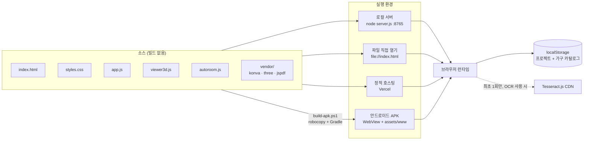
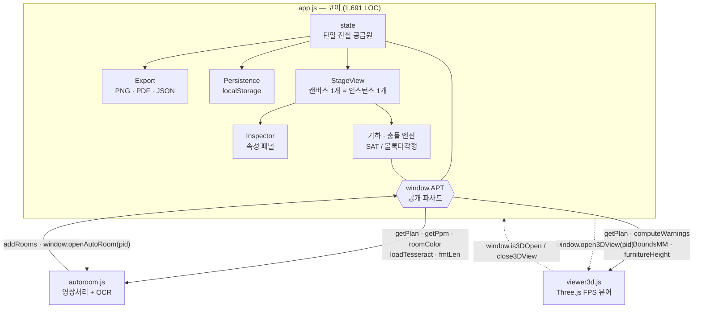
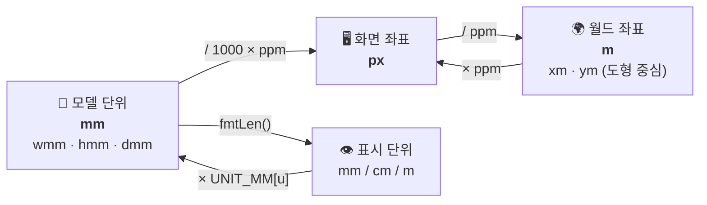
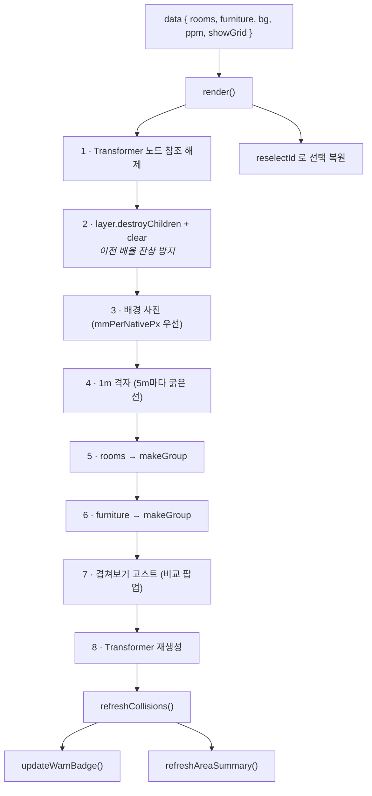
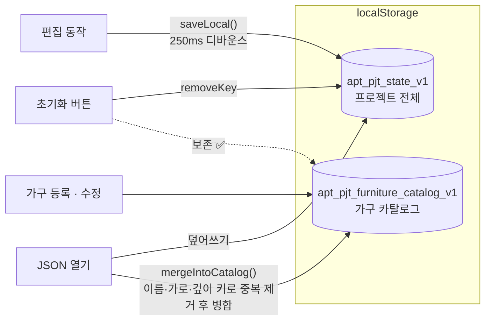
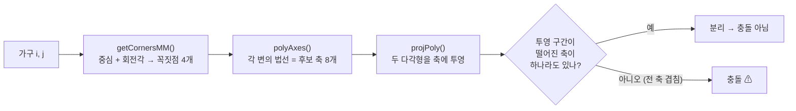
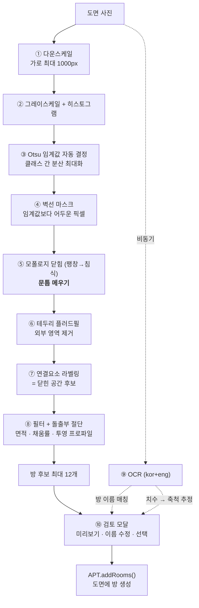
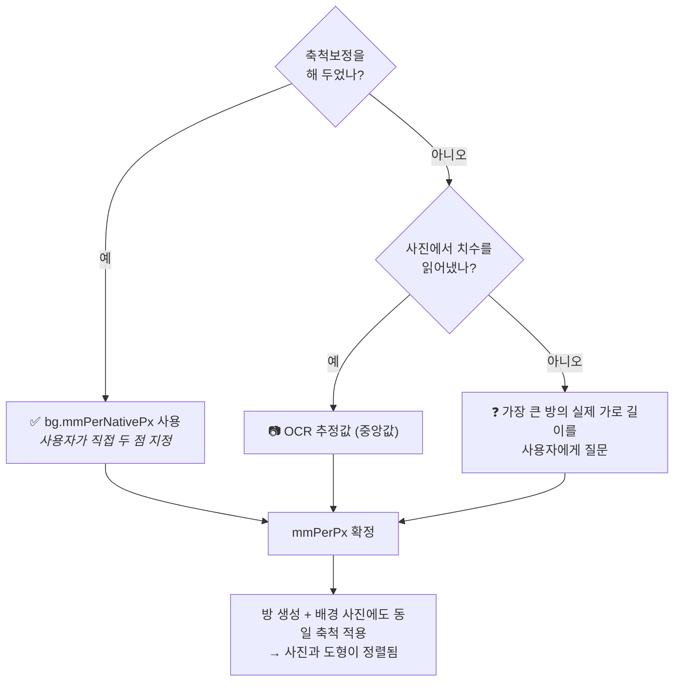
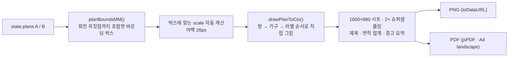
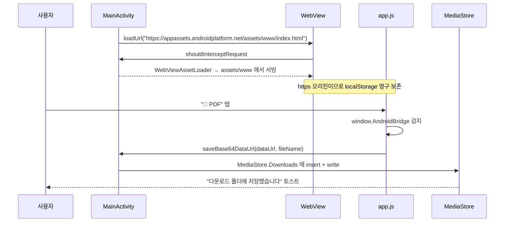

# 🏠 아파트 평면도 비교 · 가구 배치 시뮬레이터

> **"지금 쓰는 안방 침대, 이사갈 집 안방에 들어갈까?"**
> 이 질문 하나에 답하기 위해 만든, 설치가 필요 없는 평면도 비교 · 가구 배치 시뮬레이터입니다.

<p>


</p>

두 집의 평면도를 **같은 축척으로 나란히** 놓고, 실제 치수로 등록한 가구를 끌어다 놓으면서
**겹침 · 방 이탈을 실시간으로 검사**하고, **1인칭 3D 시점**으로 공간을 직접 걸어 다니며 확인합니다.
평면도 **사진 한 장만 있으면 방 구조를 자동으로 인식**해 도면을 만들어 주기도 합니다.

- 🔌 **빌드 도구 · npm 의존성 0** — `index.html` 을 열면 그대로 실행됩니다.
- 🔒 **완전 로컬 실행** — 모든 데이터는 브라우저 `localStorage` 에만 저장되고 외부로 전송되지 않습니다.
- 📱 **웹 · 데스크톱 · 안드로이드 APK** — 같은 코드베이스 하나로 3개 실행 환경을 지원합니다.

📖 **[상세 사용 설명서 (docs/USAGE.md)](docs/USAGE.md)** — 화면별 조작법 · 단축키 · FAQ

---

## 목차

- [1. 30초 만에 실행하기](#1-30초-만에-실행하기)
- [2. 주요 기능](#2-주요-기능)
- [3. 아키텍처](#3-아키텍처)
  - [3-1. 시스템 구성](#3-1-시스템-구성)
  - [3-2. 모듈 구조와 의존 방향](#3-2-모듈-구조와-의존-방향)
  - [3-3. 좌표계와 단위 체계](#3-3-좌표계와-단위-체계)
  - [3-4. 데이터 모델](#3-4-데이터-모델)
  - [3-5. StageView — 렌더링 파이프라인](#3-5-stageview--렌더링-파이프라인)
  - [3-6. 상태 저장 계층](#3-6-상태-저장-계층)
- [4. 핵심 알고리즘](#4-핵심-알고리즘)
  - [4-1. 충돌·방 이탈 판정 (SAT)](#4-1-충돌방-이탈-판정-sat)
  - [4-2. 도면 사진 → 방 자동인식](#4-2-도면-사진--방-자동인식)
  - [4-3. 축척(mm/px) 결정 전략](#4-3-축척mmpx-결정-전략)
  - [4-4. 2D → 3D 변환](#4-4-2d--3d-변환)
  - [4-5. 줌·팬과 무관한 내보내기 렌더러](#4-5-줌팬과-무관한-내보내기-렌더러)
- [5. 안드로이드 WebView 래퍼](#5-안드로이드-webview-래퍼)
- [6. 기술 스택과 설계 결정](#6-기술-스택과-설계-결정)
- [7. 파일 구성](#7-파일-구성)

---

## 1. 30초 만에 실행하기

```bash
git clone https://github.com/hbstarkim/apt-pjt.git
cd apt-pjt
node server.js          # → http://localhost:8765
```

Node.js 조차 없어도 됩니다. **`index.html` 을 브라우저로 열면** OCR을 제외한 모든 기능이 동작합니다.
(OCR은 Web Worker를 쓰기 때문에 `file://` 프로토콜에서 브라우저 보안 정책에 막힙니다.)

| 실행 방법 | 명령 | OCR | 비고 |
|---|---|:--:|---|
| 로컬 서버 (권장) | `node server.js` 또는 `./start.ps1` | ✅ | 의존성 없는 자체 정적 서버 |
| 파일 직접 열기 | `index.html` 더블클릭 | ❌ | 설치·실행 과정 전무 |
| 정적 호스팅 | Vercel (`vercel.json` 포함) | ✅ | 빌드 없이 루트를 그대로 서빙 |
| 안드로이드 앱 | `./build-apk.ps1` → `app-debug.apk` | ❌ | 오프라인 WebView 래퍼 |

예시 데이터로 둘러보려면 주소 끝에 **`?demo=1`** 을 붙여 주세요. 방 3개 + 가구가 배치된 상태로 시작하며,
일부러 **가구 충돌과 방 이탈 상황**을 섞어 두어 경고 표시를 바로 확인할 수 있습니다.

---

## 2. 주요 기능

### 📐 두 집을 같은 축척으로 비교

좌우 캔버스에 **현재 집(A)** 과 **이사갈 집(B)** 를 동시에 띄웁니다. `⇄ 축척맞춤` 버튼은 두 도면의
배율(1m당 픽셀)을 일치시켜 **크기 차이를 눈으로 바로 비교**할 수 있게 하며, 이때 보고 있던 화면 중심이
어긋나지 않도록 패닝 좌표까지 보정합니다.

```js
// app.js — matchScale()
const c = view.centerWorld();                            // 변경 전 화면 중심의 월드 좌표
view._ppm = target;
view.stage.x(view.stage.width()  / 2 - c.xm * target);   // 같은 지점이 중심에 오도록 보정
view.stage.y(view.stage.height() / 2 - c.ym * target);
```

### 🪑 실측 가구 카탈로그 + 드래그 앤 드롭 배치

가구를 **가로 × 깊이 × 높이(mm)** 로 한 번 등록해 두면 별도 `localStorage` 키에 **영구 보관**됩니다.
프로젝트를 초기화하거나 다른 JSON을 불러와도 카탈로그는 살아남아 다음 이사 때 재사용할 수 있습니다.
배치는 목록에서 캔버스로 **드래그 앤 드롭**, `→A / →B` 버튼, 툴바 `+ 가구` 메뉴 세 가지를 지원합니다.

> 가구는 실물 크기가 목적이므로 캔버스에서 **크기 조절 핸들을 의도적으로 비활성화**했습니다.
> 회전만 자유롭게 되고, 치수는 속성 패널에서 수치로만 바꿉니다.

### ⚠️ 실시간 겹침 · 방 이탈 경고

드래그·회전하는 **매 프레임** 검사합니다. 회전된 사각형(OBB)끼리도 정확히 판정하며(SAT),
2D 캔버스 · 상단 배지 · 3D 뷰 · PNG/PDF 내보내기까지 **동일한 판정 결과**가 반영됩니다.

| 표시 | 의미 |
|---|---|
| 🔴 빨강 점선 + 붉은 채움 | 다른 가구와 겹침 |
| 🟠 주황 점선 | 가구가 방 밖으로 벗어남 (일부 이탈 포함) |
| 배지 `⚠ 충돌 N개 · 방 이탈 M개` | 도면별 실시간 집계 |

### 🔍 방 대 방 비교 시뮬레이션

두 집의 방을 하나씩 클릭하면 **비교 팝업**이 열립니다.

- 두 방을 **동일 배율**로 나란히 렌더 (큰 쪽 기준으로 자동 fit)
- 면적(㎡/평) · 가로/세로 **증감 카드** (증가 초록 / 감소 빨강)
- **겹쳐보기** — 상대 방 외곽선을 점선 고스트로 오버레이
- 가구 트레이에서 좌우 방에 가구를 넣어 보는 **샌드박스** (원본 도면에는 영향 없음)

### 🧭 도면 사진 → 방 자동인식

평면도 **사진 한 장**을 올리면 영상처리로 벽선을 추출하고 닫힌 공간을 찾아 **방을 통째로 생성**합니다.
OCR이 한글 라벨(거실/안방/욕실…)을 읽어 이름을 자동으로 붙이고, `3600×4000` 같은 치수 표기를 찾아
**축척(mm/px)까지 자동 추정**합니다. → [알고리즘 상세](#4-2-도면-사진--방-자동인식)

### 🧊 1인칭 FPS 3D 공간 뷰어

2D 도면을 그대로 3차원으로 세웁니다. 방은 **바닥 슬래브 + 반투명 벽**, 가구는 **실측 W×D×H 박스**로
렌더되며, 눈높이 1.6m에서 `W/A/S/D` 로 걸어 다니고 `Space/C` 로 떠올라 조감할 수 있습니다.
충돌 가구는 붉게, 방을 벗어난 가구는 주황빛으로 **emissive 색상**이 입혀집니다.

### 🖨 배치도 내보내기 · 백업

PNG / PDF(A4 가로) 내보내기는 화면 캡처가 아니라 **모델을 오프스크린 캔버스에 직접 다시 그립니다.**
덕분에 화면을 얼마나 확대·이동해 두었든 **항상 전체 내용이 담깁니다.** 2× 슈퍼샘플링으로 선명하게 출력하며,
JSON 저장/열기로 프로젝트 전체를 파일로 백업할 수 있습니다.

---

## 3. 아키텍처

### 3-1. 시스템 구성

빌드 단계가 없습니다. 소스 파일 6개와 vendor 라이브러리 3개가 곧 배포 산출물이며,
**동일한 자산이 3개 실행 환경**에 그대로 올라갑니다.



> 외부 네트워크를 타는 경로는 **점선 하나뿐**입니다. Konva · Three.js · jsPDF는 `vendor/` 에 동봉되어
> 완전 오프라인으로 동작하고, OCR 엔진만 실제로 쓸 때 CDN에서 지연 로드합니다.

### 3-2. 모듈 구조와 의존 방향

각 모듈은 IIFE로 스코프를 격리하고, **`window.APT` 라는 단일 파사드(facade)** 로만 소통합니다.
`viewer3d.js` 와 `autoroom.js` 는 `app.js` 의 내부 상태를 직접 만지지 않으며,
반대로 `app.js` 는 두 모듈을 `window.open3DView` / `window.openAutoRoom` **존재 여부만 확인하고 호출**합니다.
→ 어느 한쪽이 로드되지 않아도 나머지 기능은 그대로 동작합니다.



**`window.APT` 인터페이스 (app.js 하단에 정의)**

| 메서드 | 방향 | 역할 |
|---|---|---|
| `getPlan(pid)` / `getUnit()` / `getPpm(pid)` | 읽기 | 도면 데이터 · 단위 · 화면 배율 조회 |
| `computeWarnings(plan)` | 읽기 | 충돌/이탈 판정 결과 (3D 색상 표현에 사용) |
| `planBoundsMM(plan)` | 읽기 | 배치 전체의 바운딩 박스 (3D 시작 위치 계산) |
| `furnitureHeight(f)` / `fmtLen(mm)` / `roomColor(n)` | 읽기 | 높이 추정 · 단위 포맷 · 팔레트 |
| `loadTesseract()` | 읽기 | OCR 엔진 지연 로더 공유 |
| `addRooms(pid, defs)` | **쓰기** | 자동인식 결과를 도면에 반영 |
| `setBgScale(pid, mmPerPx)` | **쓰기** | 추정 축척을 배경 사진에 적용 |
| `saveLocal()` / `toast(msg)` | 쓰기 | 저장 트리거 · 사용자 알림 |

### 3-3. 좌표계와 단위 체계

이 앱의 설계에서 가장 중요한 축입니다. **3개의 좌표/단위 공간**이 명확히 분리되어 있습니다.



| 공간 | 단위 | 저장 필드 | 설계 의도 |
|---|---|---|---|
| **모델(치수)** | mm 정수 | `wmm` `hmm` `dmm` | 실측 정밀도 유지, 부동소수 오차 최소화 |
| **월드(위치)** | m | `xm` `ym` (도형 **중심**) | 화면 배율과 독립 — 줌해도 위치가 변하지 않음 |
| **화면** | px | Konva 노드 좌표 | `ppm`(pixels-per-meter, 기본 55, 범위 8~400) 하나로 결정 |
| **표시** | 사용자 선택 | — | `state.unit` 변경 시 모델은 그대로, 표기만 재렌더 |

> 💡 **왜 위치는 m, 치수는 mm 인가?**
> 위치는 픽셀 ↔ 월드 변환이 매 드래그마다 일어나므로 나눗셈 횟수가 적은 m가 유리하고,
> 치수는 "3600mm" 처럼 **정수로 딱 떨어지는 실측값**이라 mm가 자연스럽습니다.
> 회전(`rot`)은 도(degree)로 통일해 Konva · Canvas 2D · Three.js 어디에도 그대로 흘려보냅니다.

### 3-4. 데이터 모델

전체 상태는 **직렬화 가능한 순수 객체 트리 하나**입니다. 이 객체를 그대로 `JSON.stringify` 하면
`localStorage` 저장본이자 `⬇ JSON 저장` 내보내기 파일이 됩니다.

```jsonc
{
  "unit": "mm",                     // 표시 단위: mm | cm | m
  "furnitureLib": [                 // 가구 카탈로그 (별도 키로도 영구 보관)
    { "id": "id...", "name": "퀸 침대",
      "wmm": 1500, "dmm": 2000, "hmm": 500, "color": "#7c9cff" }
  ],
  "plans": {
    "A": {
      "name": "현재 집 (A)",
      "ppm": 55,                    // 화면 배율 (1m = 55px)
      "showGrid": true,
      "wallmm": 2400,               // 3D 벽 높이
      "rooms": [
        { "id": "id...", "name": "거실",
          "wmm": 5000, "hmm": 3400, // 가로 × 세로
          "xm": 3.0, "ym": 1.9,     // 중심 위치(m)
          "rot": 0, "color": "#5b7cff" }
      ],
      "furniture": [
        { "id": "id...", "libId": "id...",   // 카탈로그 원본 참조
          "name": "3인 소파",
          "wmm": 2000, "dmm": 900,  // 가로 × 깊이
          "hmm": 850,               // 높이 (3D 전용)
          "xm": 3.0, "ym": 1.4, "rot": 0, "color": "#36c08a" }
      ],
      "bg": {                       // 배경 도면 사진
        "src": "data:image/png;base64,...",
        "x": 0, "y": 0,             // 화면 px 오프셋
        "opacity": 55,
        "scale": 0.2,               // 축척보정 전: 임시 표시 배율
        "mmPerNativePx": 3.42       // 축척보정 후: 원본 1px = ? mm  ← 이 값이 우선
      }
    },
    "B": { "...": "동일 구조" }
  }
}
```

**모델 설계에서 주목할 점**

- **`room.hmm` 은 세로(depth), `furniture.dmm` 이 깊이** — 방은 2D 사각형, 가구는 3D 박스라는
  의미 차이를 필드명으로 구분하고, `shapeDims(item, type)` 한 곳에서 흡수합니다.
- **가구 인스턴스는 카탈로그의 스냅샷** — `libId` 로 원본을 참조하되 치수·색상은 **복사해서** 보관합니다.
  카탈로그에서 가구를 삭제해도 이미 배치된 가구는 살아남습니다.
- **`_` 로 시작하는 키는 직렬화에서 제외** — 디코딩된 `Image` 객체 캐시(`bg._img`)나 Konva 노드 참조가
  저장본에 섞이지 않도록 `JSON.stringify` 의 replacer로 걸러냅니다.

```js
// app.js — serialize()
return JSON.stringify(state, function (k, v) {
  return k.charAt(0) === "_" ? undefined : v;
});
```

### 3-5. StageView — 렌더링 파이프라인

`StageView` 는 **캔버스 하나를 책임지는 프로토타입 기반 컴포넌트**입니다.
메인 도면 A/B와 비교 팝업의 좌우 방까지 **최대 4개 인스턴스**가 동시에 살아 있으며,
전역 배열 `allViews` 로 관리되어 "한 뷰에서 선택하면 다른 뷰는 선택 해제" 같은 규칙을 구현합니다.



**Konva 노드 ↔ 모델의 양방향 연결**

각 도형은 `Konva.Group` 하나에 사각형 · 방향 표시선 · 라벨을 담고,
그룹에 `_model`(모델 객체 참조)과 `_type`(`"room"` / `"furniture"`)을 직접 붙입니다.
이 역참조 덕분에 드래그 이벤트 핸들러가 별도 조회 없이 곧바로 모델을 갱신합니다.

```js
// makeGroup() 내부 — 단일 선택 드래그 경로 (다중 선택은 그룹 전체를 함께 이동)
g.on("dragmove", function () {
  item.xm = pxToM(g.x(), self._ppm);   // 화면 → 월드 즉시 반영
  item.ym = pxToM(g.y(), self._ppm);
  keepLabelUpright(g);                 // 회전해도 글자는 수평 유지
  self.refreshCollisions();            // 매 프레임 SAT 재판정
});
```

| 처리 | 시점 | 이유 |
|---|---|---|
| `dragmove` → 모델 갱신 + 충돌 재판정 | 매 프레임 | 즉각적 시각 피드백 |
| `dragend` → `persist()` | 조작 종료 | 저장 호출 최소화 |
| `saveLocal()` → **250ms 디바운스** | 저장 요청 시 | 연속 조작 중 `localStorage` I/O 폭주 방지 |
| `transformend` → `scale(1,1)` 리셋 | 리사이즈 종료 | 스케일을 **모델 치수(mm)에 흡수**시켜 노드 변환 누적 방지 |

> **모바일 대응 흔적** — `render()` 가 `destroyChildren()` 전에 Transformer 참조를 먼저 끊고
> `layer.clear()` 를 명시 호출하는 것, `pageshow`(bfcache 복원) 이벤트에서 캔버스를 재생성하는 것은
> 모두 실기기에서 **확대 시 이전 배율의 도형이 잔상으로 겹쳐 보이던 문제**를 잡기 위한 처리입니다.

### 3-6. 상태 저장 계층

`localStorage` 키를 **두 개로 분리**한 것이 이 앱의 UX 핵심 중 하나입니다.



| 데이터 | 키 | 초기화 시 | 다른 JSON 로드 시 |
|---|---|:--:|---|
| 도면·가구 배치·배경 | `apt_pjt_state_v1` | **삭제** | 덮어쓰기 |
| 가구 카탈로그 | `apt_pjt_furniture_catalog_v1` | **유지** | **병합** (중복 제거) |

한 번 실측해서 등록한 가구는 프로젝트와 생명주기가 다르다는 판단입니다.
이사는 몇 년에 한 번이지만 **"우리 집 침대는 1500×2000"** 이라는 사실은 변하지 않으니까요.

---

## 4. 핵심 알고리즘

### 4-1. 충돌·방 이탈 판정 (SAT)

가구는 자유 회전하므로 축 정렬 사각형(AABB) 비교로는 오판이 납니다.
**분리축 정리(Separating Axis Theorem)** 로 회전 사각형(OBB) 간 교차를 정확히 판정합니다.



- **판정 복잡도**: 가구 n개에 대해 O(n²) 쌍 × 축 8개. 실내 가구 규모(수십 개)에서는 매 프레임 돌려도 무리 없습니다.
- **`eps = 1mm` 여유**: 벽에 딱 붙인 가구가 부동소수 오차로 충돌 처리되지 않도록 1mm 관용치를 둡니다.
- **방 이탈 판정**: 가구 **중심점이 어느 방 안에 있고(`pointInConvex`) + 꼭짓점 4개가 모두 그 방 안**일 때만
  정상입니다. 즉 **일부만 삐져나와도 경고**합니다. 방이 하나도 없으면 판정 자체를 건너뜁니다.

```js
// 볼록 다각형 내부 판정 — 모든 변에 대한 외적 부호가 일치해야 내부
function pointInConvex(poly, pt) {
  let sign = 0;
  for (let i = 0; i < poly.length; i++) {
    const a = poly[i], b = poly[(i + 1) % poly.length];
    const cross = (b.x - a.x) * (pt.y - a.y) - (b.y - a.y) * (pt.x - a.x);
    if (Math.abs(cross) < 1e-6) continue;          // 변 위의 점은 통과
    const s = cross > 0 ? 1 : -1;
    if (sign === 0) sign = s; else if (s !== sign) return false;
  }
  return true;
}
```

### 4-2. 도면 사진 → 방 자동인식

`autoroom.js` 의 파이프라인입니다. **OpenCV 같은 외부 라이브러리 없이** 순수 JS + Canvas 2D로
Otsu 이진화 · 모폴로지 연산 · 연결요소 분석을 직접 구현했습니다.



**⑤ 문틈 메우기 — 이 파이프라인의 핵심**

평면도의 방은 문·개구부 때문에 **완전히 닫힌 영역이 아닙니다.** 그대로 연결요소를 찾으면 집 전체가
하나의 공간으로 뭉쳐 버립니다. 그래서 **닫힘(closing) 연산**으로 문틈을 메운 뒤 공간을 분리합니다.

```js
// 1D 팽창/침식을 가로·세로로 분리 적용 + prefix sum → O(N)
function morph1D(src, W, H, r, isDilate, horizontal) {
  const pre = new Int32Array(len + 1);
  /* ... 누적합 계산 ... */
  const s = pre[hi] - pre[lo];                       // 윈도 내 합을 O(1)로
  out[idx] = isDilate ? (s > 0 ? 1 : 0)              // 팽창: 하나라도 있으면 1
                      : (s === hi - lo ? 1 : 0);     // 침식: 전부 차야 1
}
```

반경 `r` 이 작으면 방이 하나로 뭉치고, 크면 방이 사라집니다. 사진마다 최적값이 다르므로
**6개 반경(0.7%~3.4%)을 모두 돌려 방이 가장 많이 분리되는 결과를 자동 채택**합니다.
사용자가 슬라이더로 직접 조정한 뒤 "다시 분석"할 수도 있습니다.

**⑧ 투영 프로파일로 돌출부 절단**

문틈으로 새어 나간 얇은 꼬리를 잘라내 실제 방 사각형에 근접시킵니다.
열/행별 점유 픽셀 수를 세어 **최대치의 35% 미만인 가장자리를 안쪽으로 깎습니다.**

```js
while (x0 < x1 && colCnt[x0] < mc * 0.35) x0++;   // 왼쪽에서 안쪽으로
while (x1 > x0 && colCnt[x1] < mc * 0.35) x1--;   // 오른쪽에서 안쪽으로
```

이후 **너무 작음(전체의 0.3% 미만) · 사실상 전체(60% 초과) · 형태가 산만함(채움률 0.4 미만)** 인
후보를 걸러내고 면적 내림차순 상위 12개만 남깁니다.

**⑨ OCR — 이름과 축척을 동시에**

`Tesseract.js` 를 `kor+eng` 로 돌려 단어와 줄의 **바운딩 박스**까지 받아옵니다.

| 용도 | 방식 |
|---|---|
| **방 이름** | 12종 정규식 룰(`/거실\|리빙\|LIVING/i` → "거실" 등)로 정규화 → 단어 중심점이 들어 있는 방에 배정 |
| **축척 추정** | 줄 텍스트에서 `(\d{3,5})\s*[xX×*]\s*(\d{3,5})` 패턴 추출 → 그 방의 픽셀 크기와 대조 |

축척 추정은 **긴 변끼리 · 짧은 변끼리** 각각 비율을 구해 두 값의 편차가 35% 이내일 때만 신뢰하고,
여러 방에서 얻은 추정값의 **중앙값**을 채택합니다. 오인식 한두 건에 흔들리지 않기 위해서입니다.

```js
const sA = Math.max(p.a, p.b) / Math.max(nw, nh);   // 긴 변 비율
const sB = Math.min(p.a, p.b) / Math.min(nw, nh);   // 짧은 변 비율
if (Math.abs(sA - sB) / ((sA + sB) / 2) < 0.35) ests.push((sA + sB) / 2);
/* ... */
mmPer = ests[Math.floor(ests.length / 2)];          // 중앙값 채택
```

또한 검출은 **동기(즉시)**, OCR은 **비동기(수 초)** 로 분리되어 있습니다.
사용자는 형태 검출 결과를 바로 보고, OCR이 끝나면 이름·축척이 나중에 채워집니다.

### 4-3. 축척(mm/px) 결정 전략

사진 1픽셀이 실제 몇 mm인지는 **신뢰도 순으로 3단계 폴백**을 거칩니다.



**축척보정(calibration)** 자체는 이렇게 동작합니다. 화면 클릭 좌표를 Konva의 절대 변환 행렬을
**역변환**해 배경 이미지의 원본 픽셀 좌표로 되돌린 뒤, 두 점 사이 거리로 mm/px를 계산합니다.
따라서 사진을 확대·이동한 상태에서 찍어도 결과가 동일합니다.

```js
const local = this.bgNode.getAbsoluteTransform().copy().invert().point(p);  // → 원본 px
const nativeDist = Math.hypot(b.x - a.x, b.y - a.y);
this.data.bg.mmPerNativePx = realMM / nativeDist;
```

`mmPerNativePx` 가 정해지면 배경 이미지의 표시 배율은 **화면 배율(ppm)과 연동**되어,
줌을 바꿔도 사진과 도형이 계속 정렬된 상태를 유지합니다.

```js
if (bg.mmPerNativePx) scale = (bg.mmPerNativePx / 1000) * self._ppm;
```

### 4-4. 2D → 3D 변환

3D 뷰어는 **별도의 3D 데이터를 갖지 않습니다.** 2D 모델을 매번 읽어 씬을 새로 구성합니다.
단일 진실 공급원(state) 원칙 덕분에 2D에서 무엇을 바꾸든 3D를 열면 항상 최신 상태입니다.

| 2D 모델 | → | 3D (Three.js) |
|---|:--:|---|
| `xm` (가로 위치, m) | → | `position.x` |
| `ym` (세로 위치, m) | → | `position.z` ← **평면의 y가 3D의 z** |
| `rot` (도, 시계방향) | → | `rotation.y = -rot × π/180` ← **부호 반전** |
| `wmm × hmm` (방) | → | `BoxGeometry(w, 0.04, d)` 바닥 슬래브 + 벽 4장 (두께 0.06m) |
| `wmm × dmm × hmm` (가구) | → | `BoxGeometry(w, h, d)` — 바닥에 앉도록 `y = h/2` |
| `plan.wallmm` | → | 벽 높이 (기본 2400mm, 도면별 저장) |
| `computeWarnings()` | → | 충돌 `emissive 0x7a1626` / 이탈 `emissive 0x6e4a12` |

> ⚠️ **부호 반전이 필요한 이유** — 2D 캔버스는 y축이 **아래로** 증가하고, Three.js의 z축은
> 카메라 기준 **앞으로** 증가합니다. y→z 로 매핑하면 좌우가 뒤집히므로 회전 방향을 반전시켜
> 2D에서 시계방향으로 돌린 가구가 3D에서도 같은 방향으로 보이게 맞춥니다.

**FPS 카메라 · 렌더 루프**

- `requestAnimationFrame` 기반, `dt` 는 최대 0.05초로 클램프 (탭 전환 후 순간이동 방지)
- 눈높이 1.6m, 이동 2.0 m/s / `Shift` 달리기 4.5 m/s, 고도 0.25~40m 클램프
- **Pointer Lock API** 로 마우스 시점 조작, `Esc` 한 번에 잠금 해제 → 한 번 더 누르면 닫기
- 라벨은 Canvas 2D로 그린 텍스처를 `Sprite` 로 띄워 **항상 카메라를 향하고**, `depthTest: false` 로 벽에 가려지지 않음
- 벽은 `depthWrite: false` + `DoubleSide` 반투명 — 투명 재질끼리의 정렬 아티팩트를 피하면서 벽 너머를 볼 수 있음
- 씬을 닫을 때 `geometry` · `material` · `texture` 를 **전부 순회 dispose** — 반복 열기에서 GPU 메모리 누수 방지

**모바일 터치 조작** — 터치 기기를 감지하면(`ontouchstart` / `maxTouchPoints`) 좌측 **가상 조이스틱**과
우측 **드래그 시점 조작**이 활성화됩니다. 조이스틱은 기울인 정도에 비례해 이동하고,
끝까지 밀면(크기 0.92 초과) 자동으로 달리기로 전환됩니다.

### 4-5. 줌·팬과 무관한 내보내기 렌더러

PNG/PDF는 화면 캡처가 아니라 **모델 → 오프스크린 Canvas 2D 재렌더**입니다.



이 구조 덕분에 **화면 상태와 출력이 완전히 분리**됩니다. 사용자가 어느 한쪽 도면만 확대해 두었더라도
내보낸 배치도에는 항상 두 집의 전체 내용이 같은 규칙으로 담깁니다.
경고 요약(`⚠ 충돌 N개 · 방 이탈 M개`)도 내보내기 시점에 다시 계산해 함께 인쇄합니다.

---

## 5. 안드로이드 WebView 래퍼

`android/` 는 **웹 자산을 그대로 감싸는 얇은 네이티브 셸**입니다. 자바 코드는 `MainActivity.java` 한 개뿐입니다.



| 과제 | 해결 |
|---|---|
| `file://` 오리진은 `localStorage` 가 불안정 | **`WebViewAssetLoader`** 로 `https://appassets.androidplatform.net` 가상 오리진에서 서빙 |
| WebView의 `<a download>` 가 동작하지 않음 | **`AndroidBridge`** JS 인터페이스 → base64 디코딩 → `MediaStore.Downloads` 에 기록 |
| 도면 사진 업로드(`<input type=file>`) | `WebChromeClient.onShowFileChooser` → 시스템 파일 선택기 연동 |
| 뒤로가기가 3D 뷰를 무시하고 앱을 종료 | `evaluateJavascript` 로 `window.is3DOpen()` 확인 후 **3D부터 닫음** |
| 좁은 화면에 3분할 레이아웃 | `sensorLandscape` 고정 + `☰ 가구` / `⚙ 속성` **드로어 토글** |

웹 쪽에서도 `window.AndroidBridge` 존재 여부만으로 분기하므로, **브라우저 코드에는 안드로이드 의존성이 없습니다.**

```js
function downloadDataUrl(url, name) {
  if (window.AndroidBridge && url.indexOf("data:") === 0) {
    window.AndroidBridge.saveBase64DataUrl(url, name);   // 네이티브 저장
    return;
  }
  /* ... 일반 브라우저: <a download> ... */
}
```

빌드는 `build-apk.ps1` 이 웹 자산을 `assets/www` 로 동기화(`robocopy`)한 뒤 Gradle `assembleDebug` 를 호출합니다.
**웹 코드를 고치고 스크립트만 다시 돌리면 APK가 갱신**됩니다.

---

## 6. 기술 스택과 설계 결정

| 영역 | 선택 | 이유 |
|---|---|---|
| **언어** | Vanilla JavaScript (IIFE 모듈) | 빌드 단계 제거가 최우선. `index.html` 더블클릭으로 실행되는 것 자체가 기능 |
| **2D 렌더링** | Konva.js | 히트 테스트 · 드래그 · **Transformer(회전/리사이즈 핸들)** 를 직접 구현하지 않아도 됨 |
| **3D 렌더링** | Three.js | WebGL 위에서 박스·조명·스프라이트 라벨만 쓰는 최소 활용 |
| **PDF** | jsPDF | 캔버스 이미지를 A4에 앉히는 용도로만 사용 |
| **OCR** | Tesseract.js (CDN 지연 로드) | 1MB급 엔진 + 언어 데이터를 **실제로 쓸 때만** 내려받음 |
| **영상처리** | 직접 구현 | OpenCV.js(수 MB) 대신 Otsu + 모폴로지 + 연결요소만 **200줄 남짓**으로 자체 구현 |
| **상태 관리** | 순수 객체 트리 + 수동 렌더 | 상태가 곧 저장 포맷. 프레임워크 없이도 흐름이 한눈에 보이는 규모 |
| **저장소** | `localStorage` 2키 분리 | 프로젝트와 가구 카탈로그의 **생명주기가 다름** |
| **서버** | Node 기본 모듈만 (62줄) | `npm install` 없이 `node server.js` 한 줄로 실행 |
| **배포** | Vercel 정적 (`outputDirectory: "."`) | 빌드 없이 루트를 그대로 서빙. `.vercelignore` 로 `server.js` 를 제외해 **서버리스 함수 오인식 차단** |

**의도적으로 하지 않은 것들**

- **번들러·트랜스파일러 없음** — 소스가 곧 배포본이라 디버깅 시 소스맵이 필요 없습니다.
- **npm 의존성 0** — vendor 라이브러리 3개를 저장소에 동봉해 오프라인·장기 재현성을 확보했습니다.
- **백엔드 없음** — 평면도는 개인 정보에 가깝습니다. 네트워크로 나가지 않는 것 자체가 기능입니다.

**신경 쓴 방어 코드**

- `server.js` — `path.normalize` 후 **ROOT 하위인지 검증**해 경로 탐색(path traversal) 차단, 포트 충돌 시 +1씩 10회 재시도
- `escapeHtml()` — 사용자가 입력한 방·가구 이름을 `innerHTML` 에 넣기 전 이스케이프
- `importJSON()` — 이미지 파일을 잘못 넣으면 **"📷 도면사진 버튼을 쓰세요"** 라고 구체적으로 안내
- `localStorage` 접근은 전부 `try/catch` — 사파리 프라이빗 모드 등 저장 실패 환경에서도 앱이 죽지 않음

---

## 7. 파일 구성

```
apt-pjt/
├── index.html            # 화면 구조 (툴바 · 3분할 레이아웃 · 모달 4종)      288 L
├── styles.css            # 다크 테마 · 반응형 · 모바일 드로어                247 L
├── app.js                # 코어: 상태 · StageView · 충돌 · 비교 · 내보내기  1,691 L
├── viewer3d.js           # 3D 1인칭 뷰어 (Three.js) · 터치 조작              424 L
├── autoroom.js           # 방 자동인식 (Otsu · 모폴로지 · 연결요소 · OCR)    445 L
├── server.js             # 의존성 없는 정적 서버 (Node 기본 모듈만)           62 L
├── start.ps1             # 서버 실행 + 크롬 열기
├── build-apk.ps1         # 웹 자산 동기화 + Gradle APK 빌드
├── vercel.json           # 정적 배포 설정 (빌드 없음)
├── vendor/               # 오프라인 동작을 위해 동봉
│   ├── konva.min.js      #   2D 캔버스 (171 KB)
│   ├── three.min.js      #   3D 렌더링 (594 KB)
│   └── jspdf.umd.min.js  #   PDF 생성 (357 KB)
├── android/              # 안드로이드 WebView 앱
│   ├── app/build.gradle  #   minSdk 29 · targetSdk 34 · androidx.webkit
│   └── app/src/main/java/com/aptpjt/planner/MainActivity.java
└── docs/
    └── USAGE.md          # 상세 사용 설명서 (전체 기능 매뉴얼)
```

### 코드 규모

| 구분 | 라인 수 |
|---|---:|
| 자체 작성 JavaScript (`app.js` · `viewer3d.js` · `autoroom.js` · `server.js`) | **2,622** |
| HTML + CSS | 535 |
| Android (Java + Gradle + Manifest + 리소스) | 207 |
| **합계 (vendor 제외)** | **3,364** |

---

## 라이선스 · 참고

개인 토이 프로젝트입니다. 동봉한 vendor 라이브러리는 각자의 라이선스를 따릅니다
([Konva](https://konvajs.org/) MIT · [Three.js](https://threejs.org/) MIT · [jsPDF](https://github.com/parallax/jsPDF) MIT · [Tesseract.js](https://tesseract.projectnaptha.com/) Apache-2.0).

📖 기능별 상세 조작법은 **[docs/USAGE.md](docs/USAGE.md)** 를 참고해 주세요.
